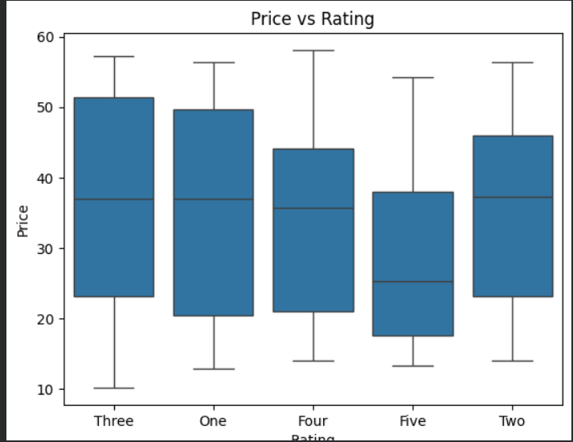
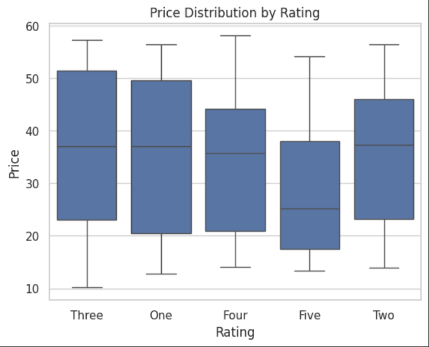

#  1.Web Scraping Project
This project extracts book data (Title, Price, Rating) from a website using Python.

# Tools Used
- Python
- BeautifulSoup
- Pandas
- Matplotlib
- Seaborn
- TextBlob

# Features
- Scraped multiple pages
- Cleaned data
- Saved as CSV

# Output
Dataanlytics.csv

#  2.Exploratory Data Analysis

- Analyzed dataset for trends and patterns
- Visualized rating distribution
- Studied price distribution
- Compared price vs rating

#  3. Data Visualization
- Created charts to understand trends
- Compared price and rating

.png)

 

# 4. Sentiment Analysis
- Performed sentiment analysis on book titles
- Classified as Positive, Negative, Neutral

#  Insights

- Most books have 3-star and 4-star ratings
- Price range is mostly between 20 and 50
- Higher rated books tend to have slightly higher prices

  
